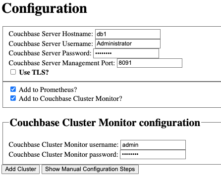

An example of using the microlith image locally and CMOS is then available via http://localhost:8080.

To run a full stack use the `Makefile` at the top of this repo and just execute the target: `make example-containers`.

This will spin up a Couchbase cluster (single node) and CMOS.
The `Add Cluster` [page](http://localhost:8080/promwebform.html) can be used to add the `db1` host with default credentials of `Administrator:password`.



**Do not use localhost or 127.0.0.1 as the IP/hostname as this will resolve to the CMOS container itself.**

Add additional clusters by running up a new Couchbase Server image and either attaching it to an existing cluster or creating a new one.
Remember to use the container local IP or if using a compose stack then you can [use the service name](https://docs.docker.com/compose/networking/).

To get the local IP of a container, in this case the `db1` container:

```
$ docker inspect -f '{{range.NetworkSettings.Networks}}{{.IPAddress}}{{end}}' db1
172.19.0.2
```

It demonstrates how to mount in custom rules and end points to scrape.

Make sure nothing else is using port 8080 already locally.

Make sure to build the CMOS container before using the local [`run.sh`](./run.sh) script via a call to `make container` or `make container-oss` as appropriate.
